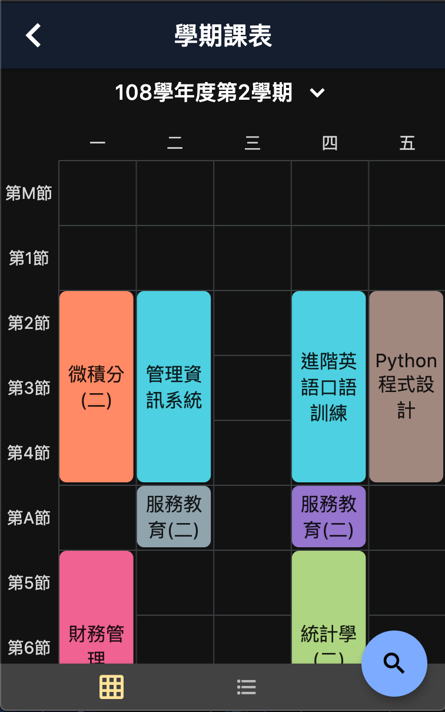
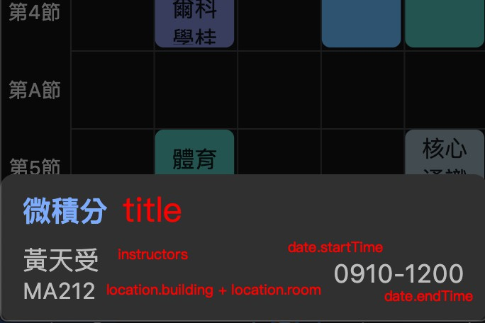

# 校務通系列介面與函式共用(施工中)

[](https://pub.dev/packages/ap_common/)
[](https://pub.dev/packages/ap_common/)

長期校務通相關系列的app，介面與相關功能都極為相似，將相關的介面與函式庫，製作此套件以方便維護。

[展示網頁](https://abc873693.github.io/ap_common_demo/#/)

## 相關專案
- [高科校務通](https://github.com/NKUST-ITC/NKUST-AP-Flutter)
- [中山校務通](https://github.com/abc873693/NSYSU-AP)
- [台科校務通](https://github.com/abc873693/NTUST-AP)

## 套件使用要求
 - Flutter `v1.20` 以上

## 目前共用項目 Todo List

 - 資源
    - [x] 主題色
        - [x] 基本顏色
        - [x] 淺色主題
        - [x] 深色主題
    - [x] 圖示
        - [x] Outline 
        - [x] Filled 
    - [x] 圖片資源(97KB)
 - 工具類
    - [x] 多國語言
    - [x] 共用函式
     - [x] 提示訊息(Toast - Flutter Level)
    - [x] SharePreferences 包裝
 - 元件
    - [x] 抽屜 `ap_drawer.dart`
    - [x] 一般對話框 `default_dialog.dart`
    - [x] 選項對話框中選項 `dialog_option.dart`
    - [x] 頁面提示 `hint_content.dart`
    - [x] 選項對話框 `option_dialog.dart`
    - [x] 進度對話框 `progress_dialog.dart`
    - [x] 設定頁元件 `setting_widget.dart`
    - [x] 是或否對話框 `yes_no_dialog.dart` 
 - 頁面(pages)
    - [x] 關於我們 `about_us_page.dart`
    - [x] 開放原始碼 `open_source_page.dart`
    - [x] 使用者資訊 `user_info_page.dart`
    - [x] 最新消息詳細資訊 `news_content_page.dart`
 - 頁面骨架(scaffold)
    - [x] [課表](#課表骨架-coursescaffold)
    - [x] [成績](#成績骨架-scorescaffold)
    - [x] [首頁](#首頁骨架-homescaffold)
    - [ ] 校園資訊
      - [ ] 教務處最新消息
      - [ ] 學校電話
      - [ ] 行事曆
    - [ ] 空堂教室查詢
    - [X] [登入頁](#首頁骨架-loginscaffold)
 
## Getting Started

在 `pubspec.yaml` 中加入 package

```yaml
    # 官方多國語套件
    flutter_localizations:
        sdk: flutter
    ap_common: ^0.4.0
```

執行加入套件

```bash
  $ flutter package get
```
### 主題色設定

在MaterialApp 上一層加入主題色模式(ThemeMode)設定 否則無法正常顯示  
此功能只支援flutter v1.9 以上的SDK

```dart
    ThemeMode themeMode = ThemeMode.system;

    @override
      Widget build(BuildContext context) {
        return ApTheme(
            themeMode,
            child: MaterialApp(
              // (選擇)是否加入 
              theme: ApTheme.light,
              darkTheme: ApTheme.dark,
              themeMode: themeMode,
            ),
        );
    }

```
### 多國語言支援列表
 - 繁體中文(zh-TW)
 - 英文(en-US)

在 `MaterialApp` 加入多國語言支援

```dart
    ThemeMode themeMode = ThemeMode.system;

    @override
      Widget build(BuildContext context) {
        return MaterialApp(
              // 在此設定使用的語言，否則會按照系統提供語言，若為不支援語言 預設為英文
              localeResolutionCallback:
                    (Locale locale, Iterable<Locale> supportedLocales) {
                  return locale;
                },
               localizationsDelegates: [
                const ApLocalizationsDelegate(),
              ],
              supportedLocales: [
                const Locale('en', 'US'), // English
                const Locale('zh', 'TW'), // Chinese
              ],
            );
    }

```

## widgets

此項目必須加入主題色設定，否則會無法正常使用

//TODO 文件

## pages

此項目必須加入多國語言設定，否則會無法正常使用

//TODO 文件

-------

## Scaffold

### 首頁骨架 ScoreScaffold

### 課表骨架 CourseScaffold

提供顯示課表(Course Table)骨架，另將課表`CourseContent`與課程列表`CourseList`另拆成兩個Ｗidget
 - 支援響應式介面
 - 支援上課通知(Android & iOS & MacOS)
 - 將課表加入至行事曆App(Android & iOS)

 手機介面

 

平板 or 桌面版介面

 

| 參數名稱                         | 型態                             | 描述                             |
| ------------------------------- | ------------------------------- | ------------------------------- |
| state | CourseState | 必要欄位，總共有 `loading` `finish` `error` `empty` `offlineEmpty` `custom` 的狀態，只有`finish`才會顯示課表介面，其餘都是顯示錯誤狀況 |
| customStateHint | String | 當 [state] 是 `custom` 時，會顯示此字串 |
| title | String | Scaffold 標題 |
| itemPicker | Widget | 使用自訂元件實作學期選擇器，[itemPicker] 與 [semesterData] 擇一使用 |
| semesterData | List<String> | 學期列表 |
| onSelect | Function(int index) | 學期列表點擊事件，回傳[semesterData]的索引值，[semesterData] 不為 Null 時才有效 |
| isShowSearchButton | String | 是否顯示搜尋按鍵，預設值為 `true` |
| onSearchButtonClick | Function | 搜尋按鍵點擊事件 |
| onRefresh | Function | 下拉更新事件 |
| actions | List<Widget> | 右上角的元件 |
| customHint | String | 學期選擇器與課表中間的提示字 |
| enableNotifyControl | bool | 是否顯示上課通知按鍵，預設值為 `true` |
| notifyData | Function | 上課通知資料 |
| autoNotifySave | bool | 是否自動儲存上課更新資料，預設值為 `true` |
| onNotifyClick | Function | 上課通知按鍵點擊事件 |
| courseNotifySaveKey | String | 若`autoNotifySave`有開啟，儲存的Preference key |
| enableAddToCalendar | bool | 是否顯示課表加入行事曆按鍵，預設值為 `true` |
| androidResourceIcon | String | Android的原生資源圖示 |

### CourseData

| 參數名稱                         | 型態                             | 描述                             |
| ------------------------------- | ------------------------------- | ------------------------------- |
| courses | List<CourseDetail> | 課表詳細資訊列表，課程列表 `CourseList` 會使用到此部分 |
| courseTables | CourseTable | 課表內容 `CourseContent` 會使用到此部分 |

### CourseDetail

此類別會影響課程列表中的介面

 

| 參數名稱                         | 型態                             | 描述                             |
| ------------------------------- | ------------------------------- | ------------------------------- |
| code | String | 課程代碼 |
| title | String | 課程名稱 |
| className | String | 課程班級 |
| group | String | 課程分組 |
| units | String | 學分數 |
| hours | String | 上課時數(單位：小時) |
| required | String | 課程類型，選修、必修等等，右上角藍字 |
| times | String | 上課節次 |
| location | Location | 上課位置 |
| instructors | List<String> | 授課老師 |

### Coursetables

| 參數名稱                         | 型態                             | 描述                             |
| ------------------------------- | ------------------------------- | ------------------------------- |
| monday | List<Course> | 星期一的課程 |
| tuesday | List<Course> | 星期二的課程 |
| wednesday | List<Course> | 星期三的課程 |
| thursday | List<Course> | 星期四的課程 |
| friday | List<Course> | 星期五的課程 |
| saturday | List<Course> | 星期六的課程 |
| sunday| List<Course> | 星期日的課程 |
| timeCodes | List<String> | 所有節次 |

### Course

 

| 參數名稱                         | 型態                             | 描述                             |
| ------------------------------- | ------------------------------- | ------------------------------- |
| title | String | 課程名稱 |
| date | Date | 上課時間 |
| location | Location | 上課位置 |
| detailIndex | int | 對應`CourseDetail`的索引值 |
| instructors | List<String> | 授課老師 |


### Date

| 參數名稱                         | 型態                             | 描述                             |
| ------------------------------- | ------------------------------- | ------------------------------- |
| startTime | String | 開始時間，格式 `HH:mm` |
| endTime | String | 結束時間，格式 `HH:mm` |
| section | String | 節次，對應 `CourseTable` 中的 `timeCodes` |

### 成績骨架 ScoreScaffold

### 登入骨架 LoginScaffold