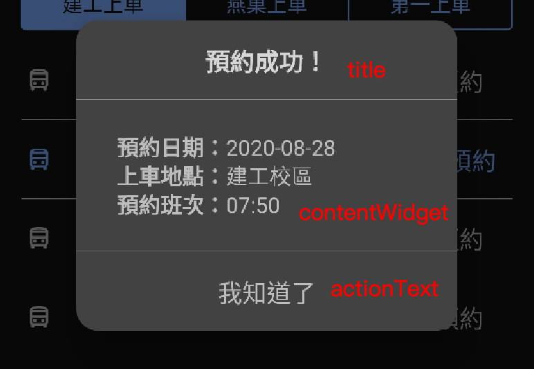
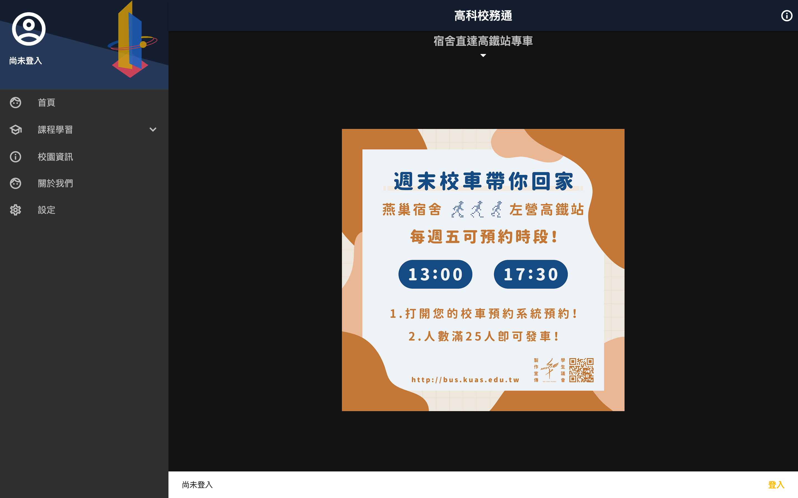
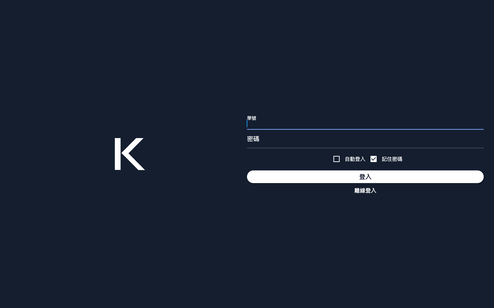

# 校務通系列介面與函式共用(施工中)

[](https://pub.dev/packages/ap_common/)
[](https://pub.dev/packages/ap_common/)

長期校務通相關系列的app，介面與相關功能都極為相似，將相關的介面與函式庫，製作此套件以方便維護。

[展示網頁](https://abc873693.github.io/ap_common_demo/#/)

## 相關專案
- [高科校務通](https://github.com/NKUST-ITC/NKUST-AP-Flutter)
- [中山校務通](https://github.com/abc873693/NSYSU-AP)
- [台科校務通](https://github.com/abc873693/NTUST-AP)

## 套件使用要求
 - Flutter `v1.20` 以上

## 目前共用項目 Todo List

 - 資源
    - [x] 主題色
        - [x] 基本顏色
        - [x] 淺色主題
        - [x] 深色主題
    - [x] 圖示
        - [x] Outline 
        - [x] Filled 
    - [x] 圖片資源(97KB)
 - 工具類
    - [x] 多國語言
    - [x] 共用函式
     - [x] 提示訊息(Toast - Flutter Level)
    - [x] SharePreferences 包裝
 - 元件
    - [x] [抽屜](#抽屜-apdrawer)
    - [x] [網路圖片](#抽屜-ApNetworkImage)
    - [x] [一般對話框](#一般對話框-DefaultDialog)
    - [x] [選項對話框中選項](#選項對話框中選項-DialogOption)
    - [x] [頁面提示](#頁面提示-HintContent)
    - [x] [選項選擇器](#選項選擇器-ItemPiccker)
    - [x] [選項對話框](#選項對話框-SimpleOptionDialog)
    - [x] [進度對話框](#進度對話框-ProgressDialog)
    - [x] [設定頁元件](#設定頁元件-SettingPageWidget)
    - [x] [是或否對話框](#是或否對話框-YesNoDialog) 
 - 頁面(pages)
    - [x] 關於我們 `about_us_page.dart`
    - [x] 開放原始碼 `open_source_page.dart`
    - [x] 使用者資訊 `user_info_page.dart`
    - [x] 最新消息詳細資訊 `news_content_page.dart`
 - 頁面骨架(scaffold)
    - [x] [課表](#課表骨架-coursescaffold)
    - [x] [成績](#成績骨架-scorescaffold)
    - [x] [首頁](#首頁骨架-homescaffold)
    - [x] 校園資訊
      - [x] 教務處最新消息
      - [x] 學校電話
      - [ ] 行事曆
    - [ ] 空堂教室查詢
    - [X] [登入頁](#首頁骨架-loginscaffold)
 
## Getting Started

在 `pubspec.yaml` 中加入 package

```yaml
    # 官方多國語套件
    flutter_localizations:
        sdk: flutter
    ap_common: ^0.4.0
```

執行加入套件

```bash
  $ flutter package get
```
### 主題色設定

在MaterialApp 上一層加入主題色模式(ThemeMode)設定 否則無法正常顯示  
此功能只支援flutter v1.9 以上的SDK

```dart
    ThemeMode themeMode = ThemeMode.system;

    @override
      Widget build(BuildContext context) {
        return ApTheme(
            themeMode,
            child: MaterialApp(
              // (選擇)是否加入 
              theme: ApTheme.light,
              darkTheme: ApTheme.dark,
              themeMode: themeMode,
            ),
        );
    }

```
### 多國語言支援列表
 - 繁體中文(zh-TW)
 - 英文(en-US)

在 `MaterialApp` 加入多國語言支援

```dart
    ThemeMode themeMode = ThemeMode.system;

    @override
      Widget build(BuildContext context) {
        return MaterialApp(
              // 在此設定使用的語言，否則會按照系統提供語言，若為不支援語言 預設為英文
              localeResolutionCallback:
                    (Locale locale, Iterable<Locale> supportedLocales) {
                  return locale;
                },
               localizationsDelegates: [
                const ApLocalizationsDelegate(),
              ],
              supportedLocales: [
                const Locale('en', 'US'), // English
                const Locale('zh', 'TW'), // Chinese
              ],
            );
    }

```

## widgets

此項目必須加入主題色設定，否則會無法正常使用


### 抽屜 ApDrawer

提供校務通v3風格抽屜，Flutter 原生的 `Drawer` 封裝  
另提供
 - DrawerItem
 - DrawerSubItem

 


| 參數名稱                         | 型態                             | 描述                             |
| ------------------------------- | ------------------------------- | ------------------------------- |
| userInfo | UserInfo | 使用者資訊，會在Header顯示 `照片`、`名字`、`學號` |
| onTapHeader | Function | Header點擊事件 |
| imageAsset | Function | Header 右邊的圖片，使用 Asset Image 載入|
| widgets | List<Announcements> | 抽屜主體的Widget List，屬於Flutter原生API |
| imageHeroTag | String | Header中的圖片支援Flutter Hero，可自訂 Tag 對應畫面的tag，預設為 `tag_student_picture` |
| displayPicture | bool | 是否顯示照片，`true`時顯示 `ApIcon` 中的 `person`  |

### 網路圖片 ApNetworkImage

由 Plugin [CachedNetworkImage](https://pub.dev/packages/cached_network_image/changelog) 封裝，此套件因為在未支援平台會錯誤，故此封裝

| 參數名稱                         | 型態                             | 描述                             |
| ------------------------------- | ------------------------------- | ------------------------------- |
| url | String | 圖片來源網址 |

### 一般對話框 DefaultDialog

提供校務通v3風格對話框，使用 Flutter 官方的 `AlertDialog` 封裝

 

| 參數名稱                         | 型態                             | 描述                             |
| ------------------------------- | ------------------------------- | ------------------------------- |
| title | String | 對話框標題 |
| contentWidget | Widget | 對話框內容的 Widget |
| actionText | String | 按鍵的文字 |
| actionFunction | Function | 按鍵點擊事件 |

### 選項對話框中選項 DialogOption

對話框 `SimpleOptionDialog` 使用的選項，也可 自訂Dialog 使用它

| 參數名稱                         | 型態                             | 描述                             |
| ------------------------------- | ------------------------------- | ------------------------------- |
| text | String | 內容文字 |
| check | bool | 是否顯示打勾的圖示 |
| onPressed | Function | 點擊事件 |

### 頁面提示 HintContent

提供校務通v3風格的提示內容

 

| 參數名稱                         | 型態                             | 描述                             |
| ------------------------------- | ------------------------------- | ------------------------------- |
| icon | IconData | 圖示 |
| content | String | 內容文字 |

### 選項選擇器 ItemPiccker

將 `SimpleOptionDialog` 功能整合至一個元件，點擊時會顯示 `SimpleOptionDialog`
 
 

| 參數名稱                         | 型態                             | 描述                             |
| ------------------------------- | ------------------------------- | ------------------------------- |
| items | List<String> | 選項列表，純文字顯示 |
| dialogTitle | String | `SimpleOptionDialog` 的標題 |
| currentIndex | int | 目前的選項的索引值 |
| onSelected | Function(int index) | `SimpleOptionDialog` 點擊事件，回傳索引值 |

### 選項對話框 SimpleOptionDialog

提供選項對話框，項目以 `DialogOption` 顯示，透過 `index` 顯示目前選取的項目

 

| 參數名稱                         | 型態                             | 描述                             |
| ------------------------------- | ------------------------------- | ------------------------------- |
| title | String | 標題 |
| items | List<String> | 選項列表，純文字顯示 |
| index | int | 目前的選項的索引值 |
| onSelected | Function(int index) | 點擊事件，回傳索引值 |

### 進度對話框 ProgressDialog

| 參數名稱                         | 型態                             | 描述                             |
| ------------------------------- | ------------------------------- | ------------------------------- |
| content | String | 內容文字 |

### 設定頁元件 SettingPageWidget

提供校務通設定頁通常會使用到的元件

 

### SettingTitle

設定頁小標題

| 參數名稱                         | 型態                             | 描述                             |
| ------------------------------- | ------------------------------- | ------------------------------- |
| text | String | 內容文字 |

### SettingSwitch

設定頁的 Switch 元件，使用 Flutter 中的 `SwitchListTile` 封裝

設定頁小標題

| 參數名稱                         | 型態                             | 描述                             |
| ------------------------------- | ------------------------------- | ------------------------------- |
| text | String | 內容文字 |
| subText | String | 內容文字說明 |
| value | bool | 是否開啟 |
| onChanged | String | 點擊事件 |

### SettingItem

設定頁的項目元件，使用 Flutter 中的 `ListTile` 封裝

設定頁小標題

| 參數名稱                         | 型態                             | 描述                             |
| ------------------------------- | ------------------------------- | ------------------------------- |
| text | String | 內容文字 |
| subText | String | 內容文字說明 |
| onTap | String | 點擊事件 |

### CheckCourseNotifyItem

目前上課提醒的封裝元件，顯示目前上課提醒的項目，使用 `SettingItem` 封裝

設定頁小標題

| 參數名稱                         | 型態                             | 描述                             |
| ------------------------------- | ------------------------------- | ------------------------------- |

### 是或否對話框 YesNoDialog 

提供校務通v3風格對話框，使用 Flutter 官方的 `AlertDialog` 封裝

 

| 參數名稱                         | 型態                             | 描述                             |
| ------------------------------- | ------------------------------- | ------------------------------- |
| title | String | 對話框標題 |
| contentWidget | Widget | 對話框內容的 Widget |
| contentWidgetPadding | Widget | 對話框內容的 Widget 的內縮間距 |
| leftActionText | String | 左邊按鍵的文字 |
| rightActionText | String | 右邊按鍵的文字 |
| leftActionFunction | Function | 左邊按鍵點擊事件 |
| rightActionFunction | Function | 右邊按鍵點擊事件 |

## pages

此項目必須加入多國語言設定，否則會無法正常使用

//TODO 文件

-------

## Scaffold

### 首頁骨架 ScoreScaffold

提供校務通首頁(Home Page)骨架
 - 支援響應式介面
   - shortestSide >= 680 會開啟平板模式
   - 平板模式開啟時 `BottomNavigationBar` 會隱藏
   - 平板模式開啟時 `Scaffold` 中的 `最新消息` 與 `BottomNavigationBar` 會被 `content` 設定的 Widget 取代，目的是可實作不跳頁顯示內容，詳細可參考 example
 - 正中間由 `announcements` 顯示輪播資訊
 - 可註冊 `HomePageScaffoldState` 存取 Snacker Bar 的行為，詳細可參考 example

手機介面

 

平板 or 桌面版介面

 

| 參數名稱                         | 型態                             | 描述                             |
| ------------------------------- | ------------------------------- | ------------------------------- |
| state | CourseState | 必要欄位，總共有 `loading` `finish` `error` `empty` `offlineEmpty` `custom` 的狀態，只有`finish`才會顯示課表介面，其餘都是顯示錯誤狀況 |
| title | String | Scaffold 標題 |
| announcements | List<Announcements> | 最新消息列表 |
| isLogin | bool | 控制下方的Snacker Bar是否顯示要登入 |
| actions | List<Widget> | 在右上角可顯示元件列表，為Flutter Scaffold原生的API |
| onTabTapped | Function(int index) | 底下`BottomNavigationBar`點擊時的事件，回傳點擊的索引值 |
| bottomNavigationBarItems | List<BottomNavigationBarItem> | 底下`BottomNavigationBar`的元素，為Flutter Scaffold原生的API |
| drawer | Widget | 左方的抽屜(Drawer)元件，為Flutter Scaffold原生的API |
| content | Widget | 使用平板介面時，右方會顯示Content的內容，`null`時則顯示首頁 |
| actions | List<Widget> | 右上角的元件 |
| floatingActionButton | Widget | Material Design 的 FloatingActionButton 位置放的元件，為Flutter Scaffold原生的API |
| onImageTapped | Function(Announcement announcement) | 點擊最新消息的圖片事件，回傳`Announcement` |
| autoPlay | Function | 是否自動輪播最新消息，預設值為 `true` |
| autoPlayDuration | bool | 最新消息自動輪播的時間間距，預設值為 `5秒` |

### AnnouncementData

| 參數名稱                         | 型態                             | 描述                             |
| ------------------------------- | ------------------------------- | ------------------------------- |
| data | List<Announcement> | 最新消息列表 |

### Announcement

| 參數名稱                         | 型態                             | 描述                             |
| ------------------------------- | ------------------------------- | ------------------------------- |
| title | String | 標題 |
| id | Date | 最新消息id |
| nextId | Location | 下一個最新消息id |
| lastId | int | 最後一個最新消息的id |
| weight | int | 權重 `HomeScaffold` 會從權重大的排序顯示 |
| imgUrl | int | 圖片網址 |
| url | int | 連結 |
| description | int | 描述 會在 `AnnouncementContentPage` 顯示 |
| publishTime | int | 發布時間，格式 `YYYY-MM-DDTHH:mm::ss` |
| expireTime | int | 過期時間 `HomeScaffold` 會讓超過此時間的最新消息不顯示，格式 `YYYY-MM-DDTHH:mm::ss` |

### 課表骨架 CourseScaffold

提供顯示課表(Course Table)骨架，另將課表`CourseContent`與課程列表`CourseList`另拆成兩個Ｗidget
 - 支援響應式介面
   - longestSide >= 880 顯示平板模式
 - 支援上課通知 (Android & iOS & MacOS)
 - 將課表加入至行事曆App (Android & iOS)
 - 提供學期列表的區域，預設只提供學期資料`SemesterData`，即可使用相關的 Callback
 - `CourseContent`中的顏色由`CourseData`中的`updateIndex()` 找出該課堂在 `CourseList` 的索引值決定，順序為Material Design的500系列顏色

 手機介面

 

平板 or 桌面版介面

 

| 參數名稱                         | 型態                             | 描述                             |
| ------------------------------- | ------------------------------- | ------------------------------- |
| state | CourseState | 必要欄位，總共有 `loading` `finish` `error` `empty` `offlineEmpty` `custom` 的狀態，只有`finish`才會顯示課表介面，其餘都是顯示錯誤狀況 |
| customStateHint | String | 當 [state] 是 `custom` 時，會顯示此字串 |
| title | String | Scaffold 標題 |
| courseData | SourseData | 課表資料，會利用其中的 課表`CourseContent`與課程列表`CourseList`顯示 |
| itemPicker | Widget | 使用自訂元件實作學期選擇器，[itemPicker] 與 [semesterData] 擇一使用 |
| semesterData | List<String> | 學期列表 |
| onSelect | Function(int index) | 學期列表點擊事件，回傳[semesterData]的索引值，[semesterData] 不為 Null 時才有效 |
| isShowSearchButton | String | 是否顯示搜尋按鍵，預設值為 `true` |
| onSearchButtonClick | Function | 搜尋按鍵點擊事件 |
| onRefresh | Function | 下拉更新事件 |
| actions | List<Widget> | 右上角的元件 |
| customHint | String | 學期選擇器與課表中間的提示字 |
| enableNotifyControl | bool | 是否顯示上課通知按鍵，預設值為 `true` |
| notifyData | Function | 上課通知資料 |
| autoNotifySave | bool | 是否自動儲存上課更新資料，預設值為 `true` |
| onNotifyClick | Function | 上課通知按鍵點擊事件 |
| courseNotifySaveKey | String | 若`autoNotifySave`有開啟，儲存的Preference key |
| enableAddToCalendar | bool | 是否顯示課表加入行事曆按鍵，預設值為 `true` |
| androidResourceIcon | String | Android的原生資源圖示 |

### CourseData

| 參數名稱                         | 型態                             | 描述                             |
| ------------------------------- | ------------------------------- | ------------------------------- |
| courses | List<CourseDetail> | 課表詳細資訊列表，課程列表 `CourseList` 會使用到此部分 |
| courseTables | CourseTable | 課表內容 `CourseContent` 會使用到此部分 |

### CourseDetail

此類別會影響課程列表中的介面

 

| 參數名稱                         | 型態                             | 描述                             |
| ------------------------------- | ------------------------------- | ------------------------------- |
| code | String | 課程代碼 |
| title | String | 課程名稱 |
| className | String | 課程班級 |
| group | String | 課程分組 |
| units | String | 學分數 |
| hours | String | 上課時數(單位：小時) |
| required | String | 課程類型，選修、必修等等，右上角藍字 |
| times | String | 上課節次 |
| location | Location | 上課位置 |
| instructors | List<String> | 授課老師 |

### Coursetables

| 參數名稱                         | 型態                             | 描述                             |
| ------------------------------- | ------------------------------- | ------------------------------- |
| monday | List<Course> | 星期一的課程 |
| tuesday | List<Course> | 星期二的課程 |
| wednesday | List<Course> | 星期三的課程 |
| thursday | List<Course> | 星期四的課程 |
| friday | List<Course> | 星期五的課程 |
| saturday | List<Course> | 星期六的課程 |
| sunday| List<Course> | 星期日的課程 |
| timeCodes | List<String> | 所有節次 |

### Course

 

| 參數名稱                         | 型態                             | 描述                             |
| ------------------------------- | ------------------------------- | ------------------------------- |
| title | String | 課程名稱 |
| date | Date | 上課時間 |
| location | Location | 上課位置 |
| detailIndex | int | 對應`CourseDetail`的索引值 |
| instructors | List<String> | 授課老師 |


### Date

| 參數名稱                         | 型態                             | 描述                             |
| ------------------------------- | ------------------------------- | ------------------------------- |
| startTime | String | 開始時間，格式 `HH:mm` |
| endTime | String | 結束時間，格式 `HH:mm` |
| section | String | 節次，對應 `CourseTable` 中的 `timeCodes` |

### 成績骨架 ScoreScaffold

提供顯示成績(Score)骨架，顯示 `ScoreData` 中的成績列表`List<Score>`資訊
 - 支援響應式介面
   - longestSide >= 880 顯示平板模式
   - 平板模式時，列表於詳細資訊會水平顯示
 - 提供學期列表的區域，預設只提供學期資料`SemesterData`，即可使用相關的 Callback

 手機介面

 

平板 or 桌面版介面

 

| 參數名稱                         | 型態                             | 描述                             |
| ------------------------------- | ------------------------------- | ------------------------------- |
| state | ScoreState | 必要欄位，總共有 `loading` `finish` `error` `empty` `offlineEmpty` `custom` 的狀態，只有`finish`才會顯示課表介面，其餘都是顯示錯誤狀況 |
| customStateHint | String | 當 [state] 是 `custom` 時，會顯示此字串 |
| title | String | Scaffold 標題 |
| scoreData | ScoreData | 成績資料，會利用其中的 `List<Score>` 顯示成績 |
| itemPicker | Widget | 使用自訂元件實作學期選擇器，[itemPicker] 與 [semesterData] 擇一使用 |
| semesterData | SemesterData | 學期列表 |
| onSelect | Function(int index) | 學期列表點擊事件，回傳[semesterData]的索引值，[semesterData] 不為 Null 時才有效 |
| isShowSearchButton | String | 是否顯示搜尋按鍵，預設值為 `true` |
| onSearchButtonClick | Function | 搜尋按鍵點擊事件 |
| onRefresh | Function | 下拉更新事件 |
| actions | List<Widget> | 右上角的元件 |
| customHint | String | 學期選擇器與課表中間的提示字 |
| middleTitle | String | 成績列表第一列的標題，預設為 `ApLocalizations` 的 `midtermScore` |
| finalTitle | String | 成績列表第二列的標題，預設為 `ApLocalizations` 的 `finalScore` |
| middleScoreBuilder | Widget Function(int index) | 成績列表第一列Builder，`Null`時預設顯示為 `Score` 參數中的 `midtermScore` |
| finalScoreBuilder | Widget Function(int index) | 成績列表第二列Builder，`Null`時預設顯示為 `Score` 參數中的 `finalScore` |
| details | List<String> | 第二區塊，列表顯示其中的資訊 |

### 登入骨架 LoginScaffold

提供校務通v3版本登入頁面骨架
 - 支援響應式介面
   - 利用手機水平與垂直顯示區隔，水平模式視為平板模式
   - 平板模式時，Logo 與 `forms` 會水平顯示
 - `forms` 會包裝在 Flutter v1.20 支援的 `AutofillGroup` 使區塊內的`TextFeild` 支援自動填入(Autofill)
 - 提供校務通風格的元件
   - ApButton : RaisedButton封裝
   - ApFlatButton : FlatButton封裝
   - ApTextFeild : TextFeild封裝
   - ApCheckBox : CheckBox封裝

 手機介面

 

平板 or 桌面版介面 or 手機水平模式

 

| 參數名稱                         | 型態                             | 描述                             |
| ------------------------------- | ------------------------------- | ------------------------------- |
| logoSource | String | 必要欄位，Logo的來源，由 `loginMode` 決定Logo顯示方式 |
| form | List<Widget> | 必要欄位，骨架正中間的表單資訊，採自由實作 |
| logoMode | LogoMode | LogoMode，logoMode 為 `text`時顯示 `logoSource` 的資訊，logoMode 為 `image` 時載入 `logoSource` 路徑的 asset image|
| enableKeyboardDoneButton | bool | 是否顯示鍵盤完成按鍵，會顯示在虛擬鍵盤正上方 |